# Báo Cáo Thực Tập

Đây là project nho nhỏ mình học và làm cho báo cáo intern 

## Tìm hiểu các tính năng của Firebase trong lập trình ứng dụng bằng Flutter

### Thực hiện chức năng CRUD với dữ liệu trên Firebase Firestore

<table>
  <tr>
    <td>
      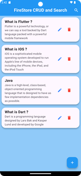  
       
      
Giao diện chung

    </td>
    <td>
      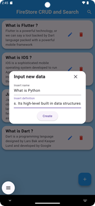  
       
      
Thêm mới data

    </td>
  </tr>
</table>
<table>
  <tr>
    <td>
      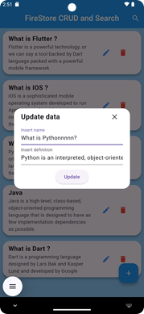  
       
      
Sửa

    </td>
    <td>
      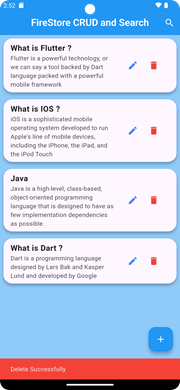  
       
      
Xoá data

    </td>
  </tr>
</table>

  <tr>
    <td>
      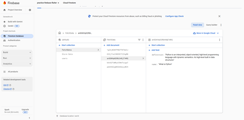  
       
      
Data on Firebase

    </td>
  </tr>

### Thực hiện chức năng đăng nhập sử dụng Firebase Authentication
<table>
  <tr>
    <td>
      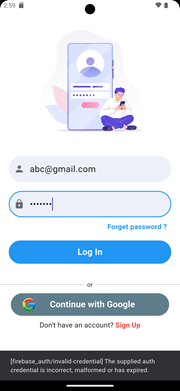  
       
      
Đăng nhập mà sai pass

    </td>
    <td>
      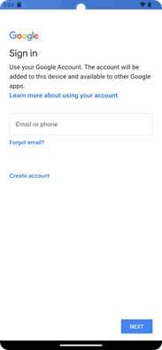  
       
      
Đăng nhap với tài khoản GG

    </td>
  </tr>
</table>

<table>
  <tr>
    <td>
      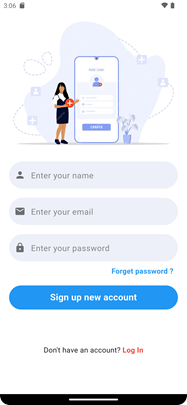  
       
      
Đăng kí tài khoản mới

    </td>
    <td>
        
       
      
Đăng kí tài khoản mới nhưng bị trùng email

    </td>
  </tr>
</table>

<table>
  <tr>
    <td>
      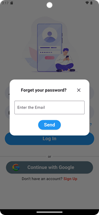  
       
      
Quên password

    </td>
    
  </tr>
</table>

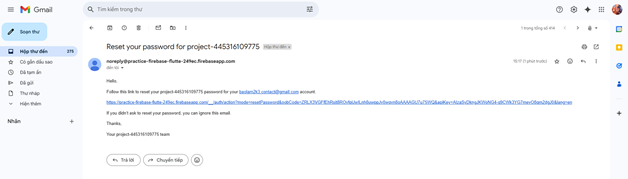  
       

Gửi link điền pass mới 

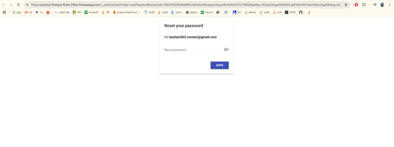  
 

reset new password

